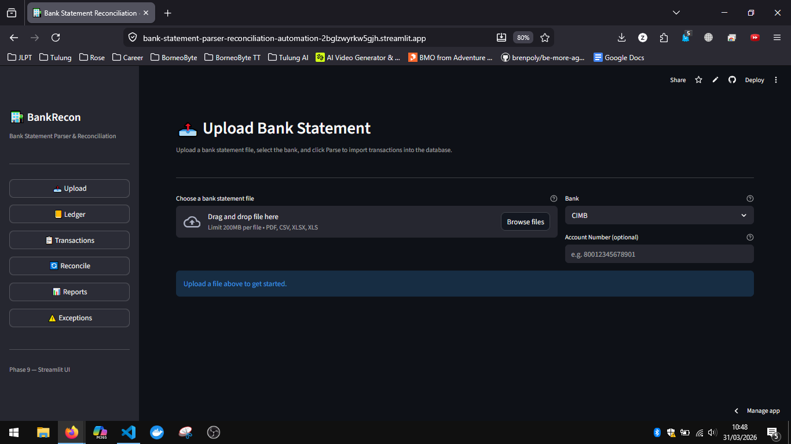
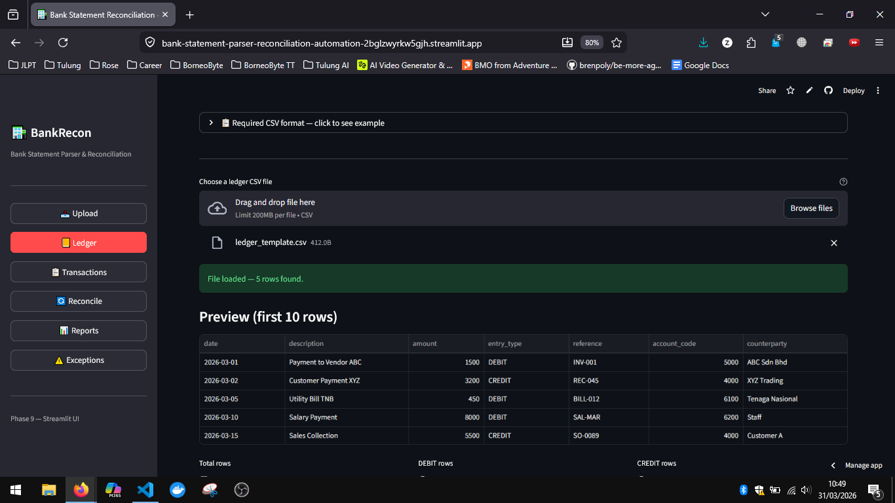
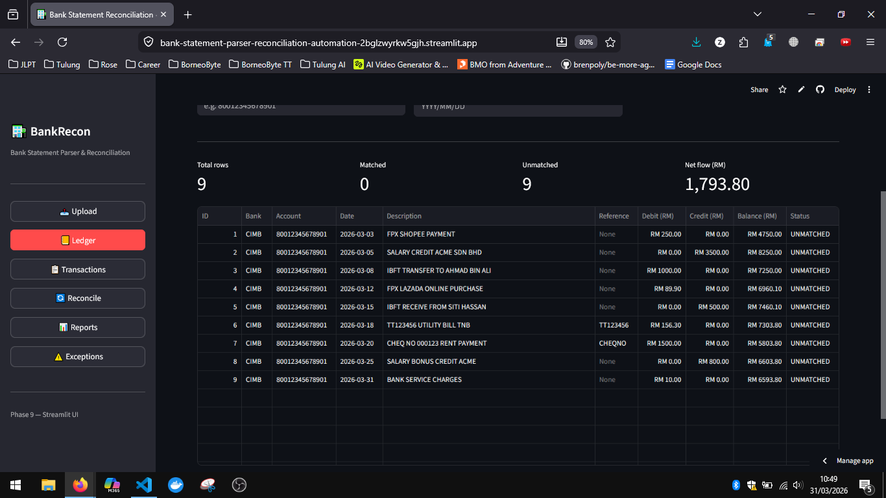
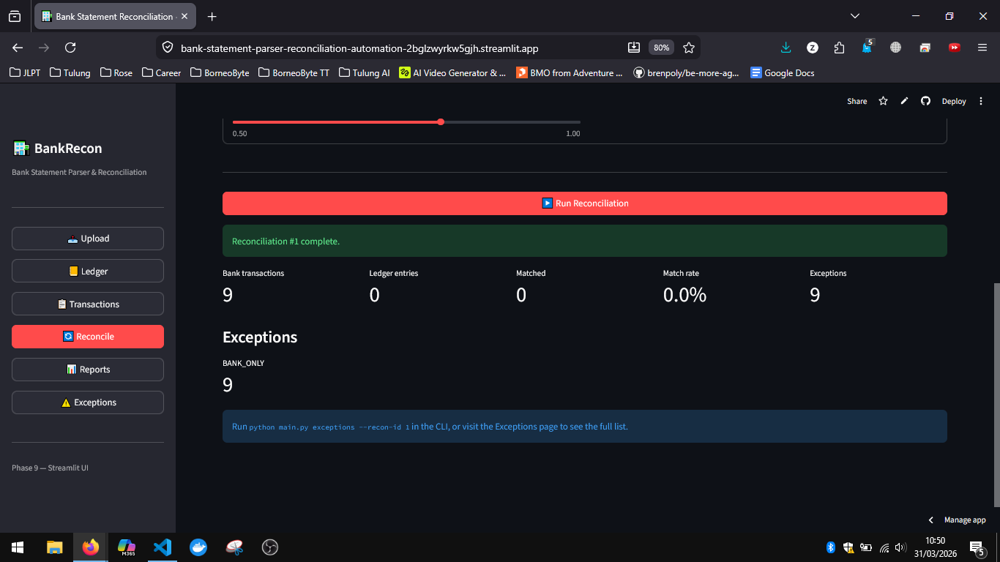
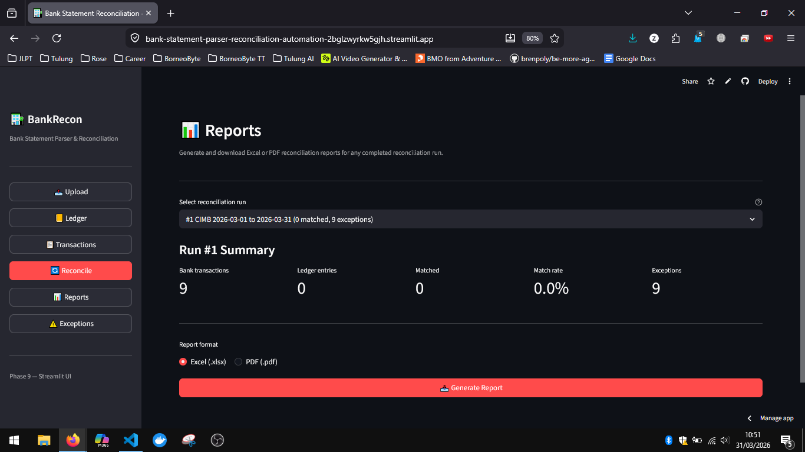
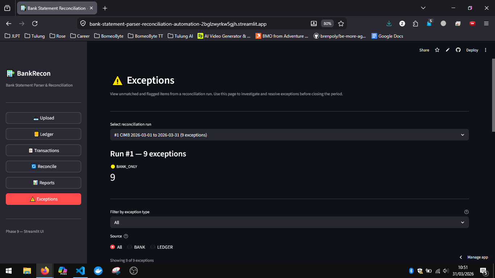
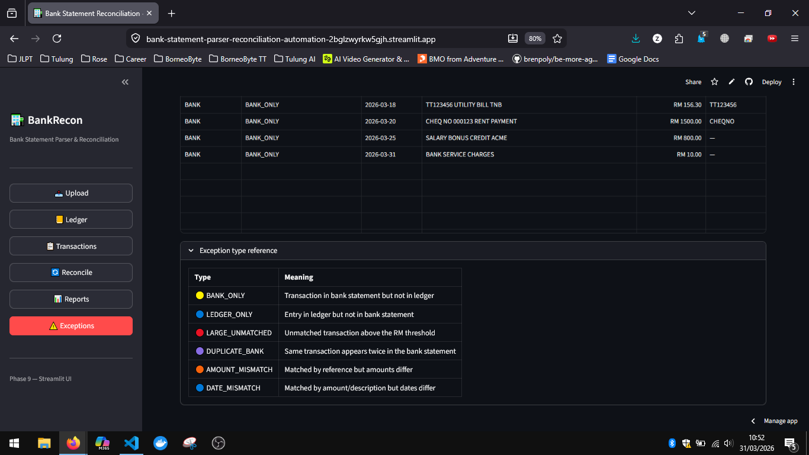

# Bank Statement Parser & Reconciliation Automation

> Automated bank statement parsing and financial reconciliation for Malaysian banks — built with Python, SQLite, and Streamlit.

**Live Demo:** [bank-statement-parser-reconciliation-automation-2bglzwyrkw5gjh.streamlit.app](https://bank-statement-parser-reconciliation-automation-2bglzwyrkw5gjh.streamlit.app/)

**Author:** Zahrin Bin Jasni
**Stack:** Python 3.13 · SQLite · Streamlit · pandas · pdfplumber · rapidfuzz · reportlab · xlsxwriter · Click · rich

---

## What Problem This Solves

Finance teams at small-to-medium businesses in Malaysia spend hours every month manually comparing bank statements against internal accounting records — cross-referencing transactions line by line in Excel, hunting for discrepancies, and producing reconciliation reports for auditors.

This tool automates that entire process:

- **Parses** bank statements from 4 major Malaysian banks (PDF, CSV, Excel) into a unified transaction schema
- **Stores** all transactions in a local SQLite database with SHA-256 duplicate prevention
- **Reconciles** bank transactions against an internal ledger using a 5-tier confidence-scored matching engine
- **Flags exceptions** — missing entries, amount mismatches, duplicates, and large unmatched items
- **Generates** downloadable Excel and PDF reports ready for audit review

What used to take a finance officer 2–4 hours is reduced to under a minute.

---

## Live Demo

Try the app directly — no installation required:

**[https://bank-statement-parser-reconciliation-automation-2bglzwyrkw5gjh.streamlit.app/](https://bank-statement-parser-reconciliation-automation-2bglzwyrkw5gjh.streamlit.app/)**

Sample files to test with are in the `tests/fixtures/` folder of this repository.

---

## Key Features

| Feature | Detail |
|---|---|
| **Multi-bank parsing** | CIMB, HLB, Maybank, Public Bank — PDF, CSV, Excel |
| **Auto column detection** | Handles split Debit/Credit columns and single Amount+Dr/Cr columns |
| **Duplicate prevention** | SHA-256 hash of date + description + amount — re-uploading the same file is safe |
| **5-tier matching engine** | Exact → Amount+Date → Amount+Ref → Fuzzy description → Amount only |
| **Fuzzy matching** | `rapidfuzz.fuzz.token_sort_ratio` handles description wording differences between banks and ledgers |
| **Exception categorisation** | 6 distinct exception types with colour-coded display |
| **Report generation** | Excel (4-sheet workbook) and PDF (executive summary) |
| **Full audit trail** | Every parse, import, reconciliation, and manual match is logged |
| **Web UI + CLI** | Streamlit web app for day-to-day use; Click CLI for scripting and automation |

---

## Screenshots

### 1. Upload Bank Statement
Upload a PDF, CSV, or Excel statement from any supported bank. The parser auto-detects the account number and statement period.



---

### 2. Import Internal Ledger
Upload your accounting ledger as a CSV with a live preview before importing. Includes a downloadable template and row-level error reporting.



---

### 3 & 4. Transaction Browser
Browse all parsed transactions across banks with filters by bank, account, date range, and reconciliation status. Net cash flow calculated automatically.




---

### 5. Reconciliation Engine
Run automated matching with configurable tolerance, fuzzy threshold, and large-amount threshold. Results show matched count, match rate, and exception breakdown instantly.



---

### 6. Report Generation
Select a reconciliation run and download a formatted Excel workbook or PDF executive summary — ready for audit or management review.



---

### 7 & 8. Exception Viewer
All unmatched and flagged items in one view. Filter by exception type, drill into each item, and reference the built-in exception type legend.





---

## Supported Banks

| Bank | PDF | CSV | Excel |
|---|---|---|---|
| CIMB | ✓ | ✓ | — |
| Hong Leong Bank (HLB) | ✓ | — | ✓ |
| Maybank | ✓ | ✓ | — |
| Public Bank | ✓ | ✓ | — |
| Generic (any bank) | ✓ | ✓ | ✓ |

---

## How It Works

### Step 1 — Upload a bank statement
Go to the **Upload** page, select your bank, and upload a PDF, CSV, or Excel file. The parser reads the file, normalises all transactions into a standard schema, and stores them in the database. Duplicate transactions are silently skipped via hash comparison.

### Step 2 — Import your internal ledger
Go to the **Ledger** page and upload a CSV of your accounting entries (accounts payable, accounts receivable, or general ledger). Preview the data before confirming the import.

### Step 3 — Run reconciliation
Go to the **Reconcile** page, select the bank and period, and click Run. The engine works through 5 matching strategies in order of confidence and produces a full match report in seconds.

### Step 4 — Review exceptions
Go to the **Exceptions** page to investigate any transactions that could not be matched. Each item is categorised so you know exactly what action is required.

### Step 5 — Download the report
Go to the **Reports** page and download an Excel workbook or PDF summary for your records or auditors.

---

## Reconciliation Matching

The engine tries strategies in priority order and stops at the first hit:

| Priority | Strategy | Confidence |
|---|---|---|
| 1 | **Exact** — same date, amount, and reference | 100% |
| 2 | **Amount + Date** — same amount, date within 1 day | 95% |
| 3 | **Amount + Reference** — same amount, reference substring match | 90% |
| 4 | **Amount + Fuzzy Description** — same amount, description similarity > 80% | 75% |
| 5 | **Amount Only** — same amount, date within 3 days | 60% |
| — | No match | flagged as exception |

Fuzzy matching uses `rapidfuzz.fuzz.token_sort_ratio` to handle real-world description inconsistencies (e.g. `"SHOPEE PAYMENT"` vs `"Payment - Shopee Online"`).

---

## Exception Types

| Type | Meaning |
|---|---|
| `BANK_ONLY` | In bank statement, not in ledger |
| `LEDGER_ONLY` | In ledger, not in bank statement |
| `AMOUNT_MISMATCH` | Matched by reference but amounts differ |
| `DATE_MISMATCH` | Matched by amount/description but dates differ > 3 days |
| `DUPLICATE_BANK` | Same transaction hash appears twice in bank statement |
| `LARGE_UNMATCHED` | Unmatched transaction above RM 5,000 |

---

## Setup (Local)

### 1. Clone the repository

```bash
git clone https://github.com/Zahrinnnnn/Bank-Statement-Parser-Reconciliation-Automation.git
cd Bank-Statement-Parser-Reconciliation-Automation
```

### 2. Create and activate a virtual environment

```bash
python -m venv venv

# Windows
venv\Scripts\activate

# macOS / Linux
source venv/bin/activate
```

### 3. Install dependencies

```bash
pip install -r requirements.txt
```

### 4. Start the web app

```bash
streamlit run app.py
```

The app opens at `http://localhost:8501`.

---

## CLI Usage

A full Click-based CLI is also available for scripting and automation:

```bash
# Parse a bank statement
python main.py parse --file statement.pdf --bank CIMB
python main.py parse --file maybank_march.csv --bank MAYBANK --account 564312345678

# Import an internal ledger
python main.py import-ledger --file ledger.csv --period 2026-03

# Run reconciliation
python main.py reconcile --bank CIMB --account 80012345678901 --period 2026-03

# Generate a report
python main.py report --recon-id 1 --format excel
python main.py report --recon-id 1 --format pdf

# View exceptions
python main.py exceptions --recon-id 1

# Manually match a transaction pair
python main.py match --bank-txn-id 42 --ledger-id 87 --note "Confirmed by finance"

# Export transactions to CSV
python main.py export --period 2026-03 --output march_transactions.csv

# View reconciliation history
python main.py history --bank CIMB --limit 10
```

---

## Ledger CSV Format

The Ledger Import page accepts a CSV with these columns:

| Column | Required | Example |
|---|---|---|
| `date` | Yes | `2026-03-01` |
| `description` | Yes | `Payment to Vendor ABC` |
| `amount` | Yes | `1500.00` |
| `entry_type` | Yes | `DEBIT` or `CREDIT` |
| `reference` | No | `INV-001` |
| `account_code` | No | `5000` |
| `counterparty` | No | `ABC Sdn Bhd` |

A downloadable template is available directly on the Ledger page inside the app.

---

## Database Schema

Five SQLite tables:

| Table | Purpose |
|---|---|
| `bank_transactions` | All parsed bank statement rows |
| `ledger_entries` | Internal ledger / AP / AR records |
| `reconciliations` | One row per reconciliation run |
| `reconciliation_matches` | Individual matched pairs per run |
| `audit_log` | Full audit trail of every system action |

Duplicate transactions are prevented by storing a SHA-256 hash of `date + description + debit + credit` in `bank_transactions.hash` with a UNIQUE constraint.

---

## Project Structure

```
bank-statement-parser/
├── main.py                 # CLI entry point (Click)
├── app.py                  # Streamlit web UI entry point
├── requirements.txt
├── data/
│   ├── database.db         # SQLite database (created on first run)
│   └── reports/            # Generated Excel and PDF reports
├── src/
│   ├── parsers/
│   │   ├── base_parser.py          # Abstract BaseParser + ParsedTransaction
│   │   ├── cimb_parser.py          # CIMB PDF and CSV parser
│   │   ├── hlb_parser.py           # Hong Leong Bank PDF and Excel parser
│   │   ├── maybank_parser.py       # Maybank PDF and CSV parser
│   │   ├── public_bank_parser.py   # Public Bank PDF and CSV parser
│   │   ├── csv_parser.py           # Generic CSV parser
│   │   ├── excel_parser.py         # Generic Excel parser
│   │   ├── pdf_parser.py           # Generic PDF parser
│   │   └── factory.py              # Parser factory
│   ├── database/
│   │   ├── connection.py           # SQLite connection and schema
│   │   ├── models.py               # Dataclasses for all 5 tables
│   │   └── queries.py              # All SQL queries as named functions
│   ├── reconciliation/
│   │   ├── engine.py               # Main reconciliation runner
│   │   ├── matching.py             # 5 match strategies
│   │   └── exceptions.py           # Exception categorisation
│   ├── reports/
│   │   ├── excel_report.py         # 4-sheet Excel workbook generator
│   │   └── pdf_report.py           # PDF executive summary generator
│   └── utils/
│       ├── normaliser.py           # Date/amount/description normalisation
│       ├── validators.py           # Input validation helpers
│       └── logger.py               # Rotating file + console logger
├── tests/
│   ├── test_parsers.py
│   ├── test_reconciliation.py
│   ├── test_reports.py
│   ├── test_phase8.py
│   ├── test_maybank_public_bank.py
│   └── fixtures/                   # Sample bank statement files for testing
└── ui/
    ├── pages/
    │   ├── upload.py
    │   ├── ledger.py
    │   ├── transactions.py
    │   ├── reconcile.py
    │   ├── reports.py
    │   └── exceptions.py
    └── components/
        ├── sidebar.py
        └── table.py
```

---

## Running Tests

```bash
python -m pytest
```

Run with verbose output:

```bash
python -m pytest -v
```

**247 tests passing** across parsers, reconciliation engine, report generators, CLI commands, and Maybank/Public Bank specific cases.
